<div align="center">
  <h1>Mr_Fortuna</h1>
  <p><b>Пью бетон evriday</b> · <i>ъ!</i></p>

  <p>
    <code>programmer</code> · <code>3D</code> · <code>Minecraft stuff</code> · <code>web</code>
  </p>

  <p>
    <a href="https://github.com/mrf0rtuna4">
      
    </a>
    <a href="https://t.me/mr_fortuna">
      
    </a>
    <a href="https://fortuna.heypers.org/">
      
    </a>
  </p>
</div>


<div align="center">
  <h2>⚙️ что тут вообще происходит</h2>
</div>

> 時々💀のように見えます
> そうすると急に便利になるんです

- **小さいはずだった**ことを書いています
- Minecraft を壊して元に戻します
- Web + Discordをやっています
- 時々 3D に入って戻らなくなることがあります


<div align="center">
  <h2>💣 stack</h2>
</div>

<p align="center">
  
  
  
  
  
  
</p>


<div align="center">
  <h2>📦 штуки которые стоит открыть</h2>
</div>

<table>
  <tr>
    <td width="50%" valign="top">
      <h3>🎲 RandomLoot</h3>
      <p>рандом вместо логики, minecraft страдает.</p>
      <p><code>Java</code><code>Gradle</code><code>loot goes brrr</code></p>
    </td>
    <td width="50%" valign="top">
      <h3>📦 FolderSyncer</h3>
      <p>синхронит папки. молча типа</p>
      <p><code>JS</code><code>it just works</code></p>
    </td>
  </tr>
  <tr>
    <td width="50%" valign="top">
      <h3>aeoncord</h3>
      <p>смешарик, фрейм по д.апи но структура разделяет ответственность</p>
      <p><code>trust me, Python</code></p>
    </td>
    <td width="50%" valign="top">
      <h3>📝 AutoTranslator</h3>
      <p>переводит README пока ты спишь</p>
      <p><code>Python / Workflow</code></p>
    </td>
  </tr>
  <tr>
    <td width="50%" valign="top">
      <h3>🛡 PolicyLockLLM</h3>
      <p>закрывает доступ туда куда не надо</p>
      <p><code>JS</code><code>bonk</code></p>
    </td>
    <td width="50%" valign="top">
      <h3>🌐 site</h3>
      <p>Не придумал, просто прикольно</p>
      <p><code>html moment</code></p>
    </td>
  </tr>
</table>


<div align="center">
  <h2>🧠 mindset</h2>
</div>

```

делай просто → потом делай нормально → потом не трогай если работает

```

- 半年後にコードを開いても恥ずかしくないところが気に入っています
- 奇妙なスタック = 通常の解決策
- 簡略化できる場合は簡略化する必要があります
- できないなら、要するに、できるふりをしましょう


<div align="center">
  <h2>📡 связь</h2>
</div>

<p align="center">
  <a href="https://github.com/mrf0rtuna4">
    
  </a>
  <a href="https://t.me/mr_fortuna">
    
  </a>
  <a href="https://fortuna.heypers.org/">
    
  </a>
</p>


<details>
  <summary>⚠️ legal stuff (очень серьёзно)</summary>

  <p>
    этот контент настолько мощный что защищён вселенной.<br>
あなたがコピーする→弁護士が来る→コード自体にバグが現れる。
  </p>
</details>


## ❄️ 統計

<div align="center">
  
  
</div>


<p align="center">
  
  
</p>


<p align="center">
  
</p>


<p align="center">
  
  
</p>